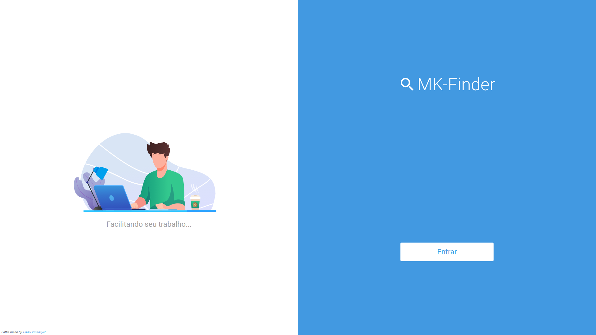
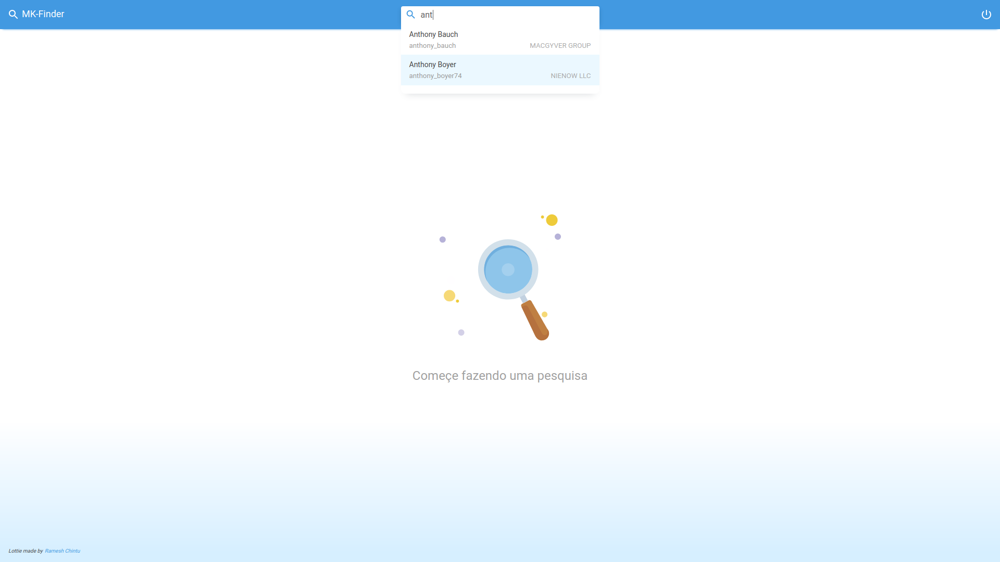
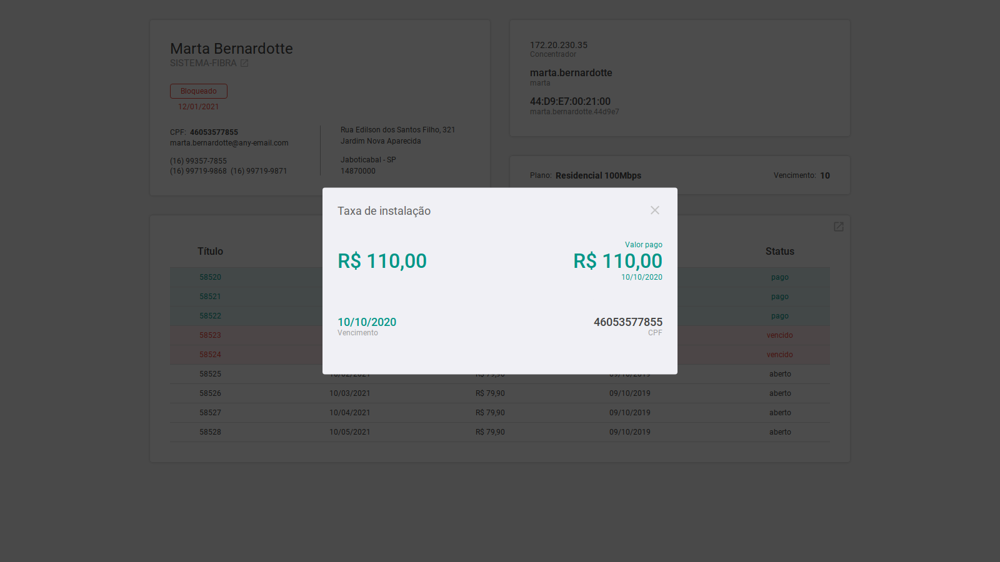
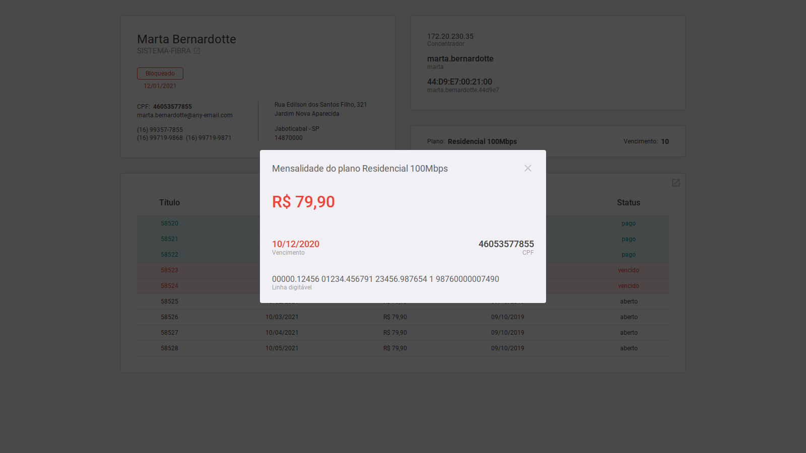

<h1 align="center">
  
   
</h1>
 
 
<h2>Tela de início</h2>
 
 

  

 
 
 
 
<h2>Pesquisa e Dashboard</h2>
 
 
<h3 align="center">Pesquisa</h3>
 
 

  

 
 
 
 
<h3 align="center">Dashboard</h3>
 
 

  

 
 
 
 
<h2>Detalhes das faturas</h2>
 
 
<h3 align="center">Fatura paga</h3>
 
 

  

 
 
 
 
<h3 align="center">Fatura em aberto</h3>
 
 

  

