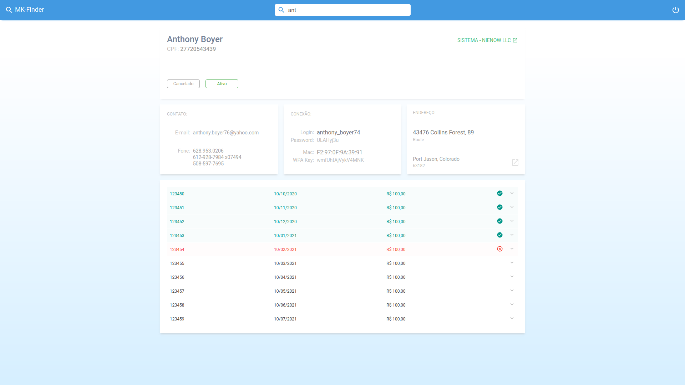

<h1 align="center">
  
   
</h1>

 

  

 
 

  Com o MkFinder, você não precisa entrar em vários sistemas até encontrar o cadastro que está procurando. Com apenas uma consulta, você atende seu cliente com mais agilidade.

 
 
 
<h1>MK-Finder</h1>
 
<h3>Pra que serve isso?</h3>
 

  Eu uso o sistema <a href="http://mk-auth.com.br/page/mkauth-1">MK-Auth</a>, um sistema para Provedores de Internet. Preciso acessar mais de um sistema desse. Com o MK-Finder posso fazer isso num lugar só e atender o cliente com mais agilidade.

 
 
<h3>Demonstração</h3>
 

  Que tal uma demonstração? Acesse <a href="https://mkfinder.netlify.app">mkfinder.netlify.app</a> e tenha uma ideia de como esse sistema funciona.

 

  Lembrando que os dados da api são <strong>fake</strong> e estão hospedados no <a href="https://www.heroku.com">Heroku</a>. Eles podem demorar um pouco no primeiro carregamento. Então, não desanime se a sua primeira pesquisa demorar.

 
 
<h3>Repositórios</h3>
 

- [Middleware API](https://github.com/kilsonrs/mkfinder-api)
- [Web client](https://github.com/kilsonrs/mkfinder-web)

 
 
<h3>Imagens</h3>
 

- [Telas do projeto](Imagens.md)

 
 

<h3>License</h3>

This project is licensed under the MIT License - see the [LICENSE](LICENSE) file for details.

---

Kilson 👋 &nbsp;[See my linkedin](https://www.linkedin.com/in/kilsonrs/)

