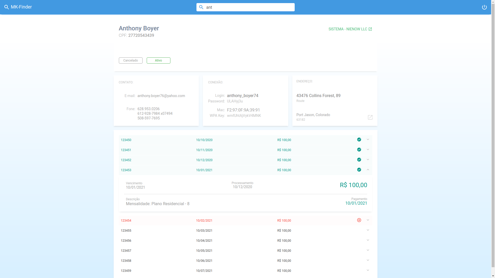

# MkFinder

## Objetivo
Fazer consultas em vários sistemas simultâneamente. Isso dá mais agilidade no atendimento ao cliente.

## Repositórios
- [Middleware API](https://github.com/kilsonrs/mkfinder-api)
- [Web client](https://github.com/kilsonrs/mkfinder-web)

## Imagens
 
### Pesquisa e Dashboard

 
	
	

### Detalhes das faturas

 
	
	

## 📝 License

This project is licensed under the MIT License - see the [LICENSE](LICENSE) file for details.

---

by Kilson  👋 &nbsp;[See my linkedin](https://www.linkedin.com/in/kilsonrs/)
